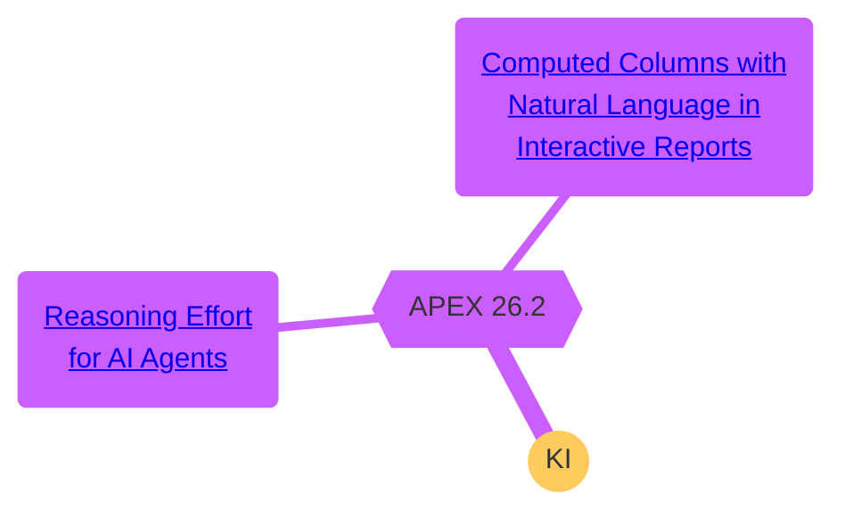
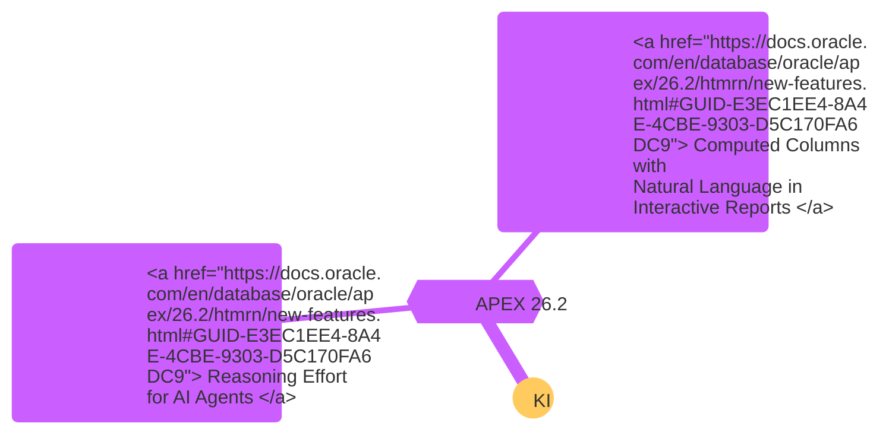
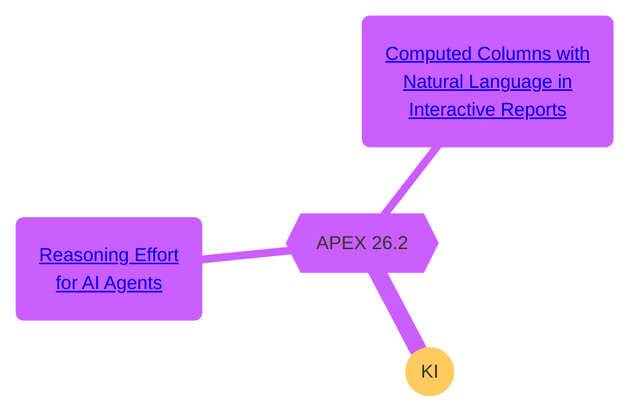

# Label-Test

## X1 Standard

```mermaid
---
config:
  theme: base
---
mindmap
  root(("KI"))
    r{{"APEX 26.2"}}
      a("<a href='https://docs.oracle.com/en/database/oracle/apex/26.2/htmrn/new-features.html#GUID-E3EC1EE4-8A4E-4CBE-9303-D5C170FA6DC9'>Reasoning Effort<br/>for AI Agents</a>")
      b("<a href='https://docs.oracle.com/en/database/oracle/apex/26.2/htmrn/new-features.html#GUID-E3EC1EE4-8A4E-4CBE-9303-D5C170FA6DC9'>Computed Columns with<br/>Natural Language in<br/>Interactive Reports</a>")
```

## X2 fontFamily arial

```mermaid
---
config:
  theme: base
  themeVariables:
    fontFamily: arial
---
mindmap
  root(("KI"))
    r{{"APEX 26.2"}}
      a("<a href='https://docs.oracle.com/en/database/oracle/apex/26.2/htmrn/new-features.html#GUID-E3EC1EE4-8A4E-4CBE-9303-D5C170FA6DC9'>Reasoning Effort<br/>for AI Agents</a>")
      b("<a href='https://docs.oracle.com/en/database/oracle/apex/26.2/htmrn/new-features.html#GUID-E3EC1EE4-8A4E-4CBE-9303-D5C170FA6DC9'>Computed Columns with<br/>Natural Language in<br/>Interactive Reports</a>")
```

## X3 htmlLabels false

```mermaid
---
config:
  theme: base
  htmlLabels: false
---
mindmap
  root(("KI"))
    r{{"APEX 26.2"}}
      a("<a href='https://docs.oracle.com/en/database/oracle/apex/26.2/htmrn/new-features.html#GUID-E3EC1EE4-8A4E-4CBE-9303-D5C170FA6DC9'>Reasoning Effort<br/>for AI Agents</a>")
      b("<a href='https://docs.oracle.com/en/database/oracle/apex/26.2/htmrn/new-features.html#GUID-E3EC1EE4-8A4E-4CBE-9303-D5C170FA6DC9'>Computed Columns with<br/>Natural Language in<br/>Interactive Reports</a>")
```

## X4 fontSize 12px

```mermaid
---
config:
  theme: base
  themeVariables:
    fontSize: 12px
---
mindmap
  root(("KI"))
    r{{"APEX 26.2"}}
      a("<a href='https://docs.oracle.com/en/database/oracle/apex/26.2/htmrn/new-features.html#GUID-E3EC1EE4-8A4E-4CBE-9303-D5C170FA6DC9'>Reasoning Effort<br/>for AI Agents</a>")
      b("<a href='https://docs.oracle.com/en/database/oracle/apex/26.2/htmrn/new-features.html#GUID-E3EC1EE4-8A4E-4CBE-9303-D5C170FA6DC9'>Computed Columns with<br/>Natural Language in<br/>Interactive Reports</a>")
```

## X5 fontFamily monospace

```mermaid
---
config:
  theme: base
  themeVariables:
    fontFamily: monospace
---
mindmap
  root(("KI"))
    r{{"APEX 26.2"}}
      a("<a href='https://docs.oracle.com/en/database/oracle/apex/26.2/htmrn/new-features.html#GUID-E3EC1EE4-8A4E-4CBE-9303-D5C170FA6DC9'>Reasoning Effort<br/>for AI Agents</a>")
      b("<a href='https://docs.oracle.com/en/database/oracle/apex/26.2/htmrn/new-features.html#GUID-E3EC1EE4-8A4E-4CBE-9303-D5C170FA6DC9'>Computed Columns with<br/>Natural Language in<br/>Interactive Reports</a>")
```
